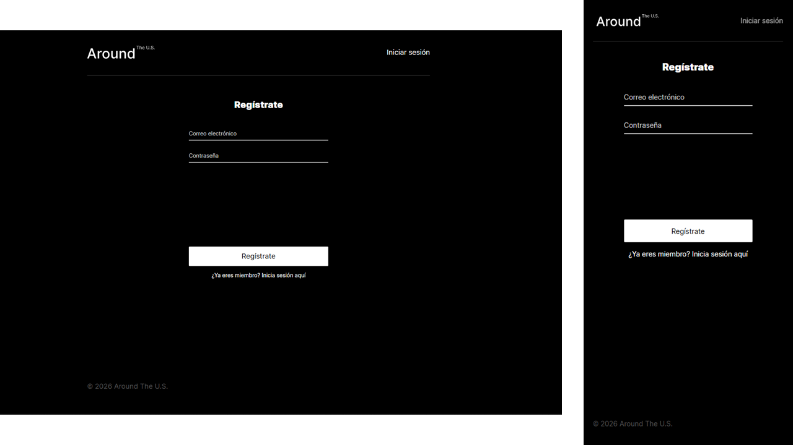
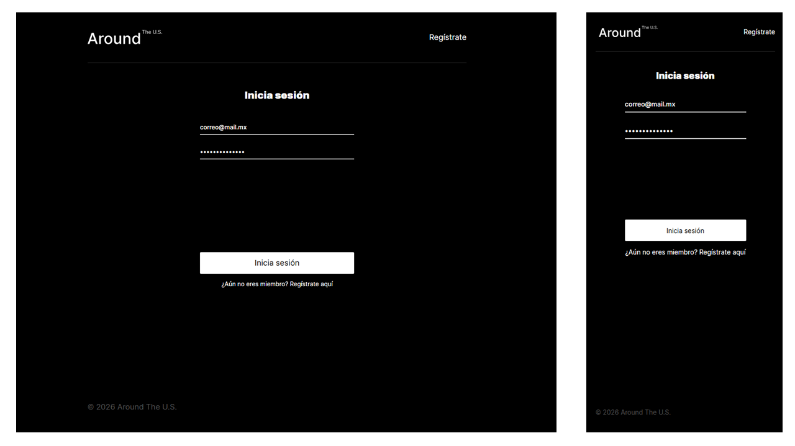
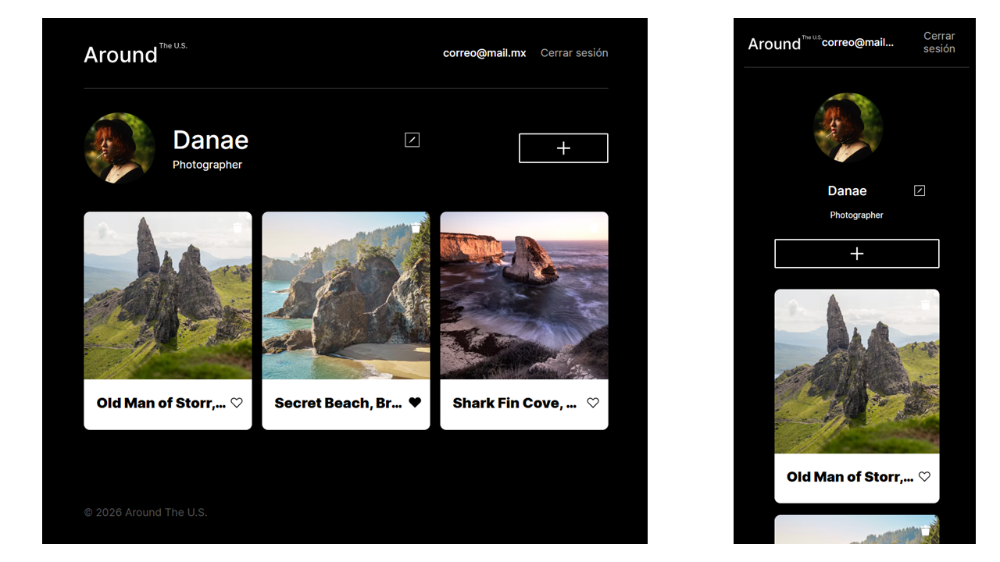
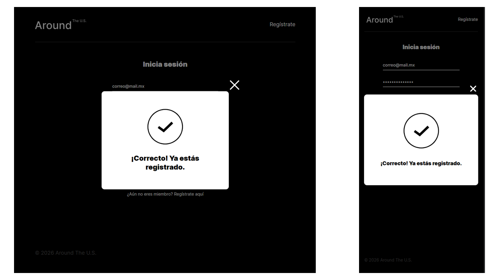
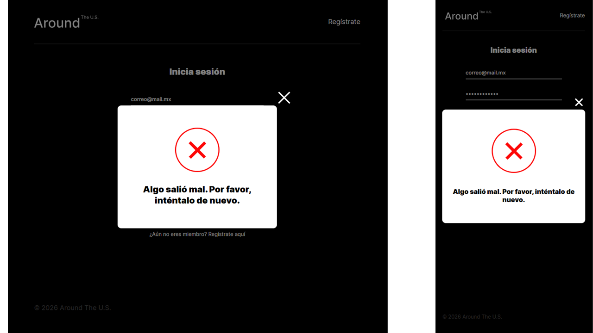

# Around The U.S.

Aplicación web full-stack para compartir lugares memorables mediante tarjetas con fotografías. Cada usuario puede registrarse, iniciar sesión, editar su perfil y su avatar, agregar tarjetas, dar o quitar "me gusta" y eliminar las tarjetas que ha creado.

Este repositorio reúne en un solo proyecto el front end (React) y la API (Express) desarrollados en los sprints anteriores del bootcamp.

## Capturas de pantalla

### Registro



### Inicio de sesión



### Página principal



### Registro exitoso



### Error al iniciar sesión



## Funcionalidad

- **Registro e inicio de sesión** de usuarios mediante la API de autenticación de TripleTen.
- **Sesión persistente:** el token se guarda en `localStorage` y se valida al cargar la página, por lo que al recargar el usuario no vuelve a iniciar sesión.
- **Cierre de sesión** desde el encabezado, que elimina el token.
- **Rutas protegidas:** `/` solo es accesible con sesión; `/signin` y `/signup` solo para visitantes. Cualquier otra ruta redirige según el estado de la sesión.
- **Ventana informativa** (`InfoTooltip`) que comunica el resultado del registro y los errores al iniciar sesión.
- **Perfil:** edición del nombre, la descripción y el avatar.
- **Tarjetas:** listado, creación, "me gusta" y eliminación de las propias.
- **Ventana emergente de imagen** al hacer clic en una tarjeta.
- **Encabezado adaptado** al estado del usuario: visitante (enlace a registro o inicio de sesión) o autenticado (correo y cierre de sesión).

## Tecnologías y técnicas

**Front end (`client/`)**

- React 19 con componentes funcionales y Hooks (`useState`, `useEffect`, `useContext`, `useRef`).
- TypeScript con tipado de props, estado y respuestas de la API.
- Vite como herramienta de desarrollo y construcción.
- React Router (`react-router-dom`) para el enrutamiento y las rutas protegidas.
- Contexto de React (`CurrentUserContext`) para compartir los datos del usuario.
- Estado de autenticación con tres valores (`checking`, `authenticated`, `guest`) para evitar redirecciones erróneas mientras se valida el token.
- Peticiones con `fetch` y `async/await`, centralizadas en `utils/api.ts` (API propia) y `utils/auth.ts` (API de autenticación).
- Validación de formularios con atributos nativos de HTML y la API de validación del navegador.
- CSS con metodología BEM y arquitectura por bloques.

**Back end (`server/`)**

- Node.js con Express y TypeScript.
- MongoDB con Mongoose.
- CORS configurado para el origen del front end.

## Estructura del proyecto

```
web_project_around_full/
├── client/               # Aplicación de React
│   ├── index.html
│   └── src/
│       ├── blocks/       # Estilos por bloque (BEM)
│       ├── components/   # Componentes de React
│       ├── contexts/     # CurrentUserContext
│       ├── hooks/        # Hooks personalizados
│       ├── images/
│       ├── interfaces/   # Tipos de TypeScript
│       ├── utils/        # api.ts y auth.ts
│       ├── main.tsx
│       └── index.css
├── server/               # API de Express
│   └── src/
├── screenshots/          # Capturas de pantalla del README
├── .gitignore
├── package.json          # Scripts de la raíz
└── README.md
```

## Requisitos previos

- [Node.js](https://nodejs.org/) (versión LTS).
- [MongoDB](https://www.mongodb.com/try/download/community) en ejecución local en el puerto `27017`. La API se conecta a la base de datos `aroundb`.

## Instalación y ejecución

1. Clona el repositorio:

```bash
   git clone https://github.com/<tu-usuario>/web_project_around_full.git
   cd web_project_around_full
```

2. Instala las dependencias del cliente y del servidor con un solo comando:

```bash
   npm run install:all
```

3. Verifica que MongoDB esté en ejecución y levanta cada mitad en su propia terminal:

```bash
   npm run dev:server   # API en http://localhost:3001
   npm run dev:client   # Aplicación en http://localhost:3000
```

4. Abre [http://localhost:3000](http://localhost:3000). Al no tener sesión, serás redirigido a `/signin`.

Para generar la versión de producción del front end:

```bash
npm run build --prefix client
```

## API propia

La API de Express corre en `http://localhost:3001` y expone estos recursos:

| Método | Ruta | Descripción |
| --- | --- | --- |
| `GET` | `/users/me` | Datos del perfil |
| `PATCH` | `/users/me` | Actualiza nombre y descripción |
| `PATCH` | `/users/me/avatar` | Actualiza el avatar |
| `GET` | `/cards` | Lista de tarjetas |
| `POST` | `/cards` | Crea una tarjeta |
| `DELETE` | `/cards/:cardId` | Elimina una tarjeta propia |
| `PUT` | `/cards/:cardId/likes` | Da "me gusta" |
| `DELETE` | `/cards/:cardId/likes` | Quita el "me gusta" |

## Autenticación

El registro, el inicio de sesión y la comprobación del token usan la API de autenticación de TripleTen (`https://se-register-api.en.tripleten-services.com/v1`), a través de los endpoints `/signup`, `/signin` y `/users/me`. El encabezado `Authorization` se envía únicamente a `/users/me`.

## Estado del proyecto

La autenticación de la API propia es provisional: el servidor identifica al usuario mediante un middleware temporal. En el siguiente sprint se implementará la autenticación segura en el back end con tokens JWT.